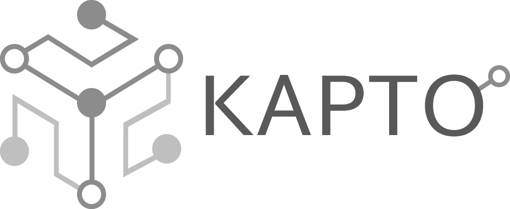

# Kapto

The Kapto service is being developed under [H2IOSC project](https://www.h2iosc.cnr.it/) as part of task 7.7 (E-RIHS pilot "Interlumo").
It can be deployed on any node to capture remote interactions. A cluster deployment is recommended (e.g. via PM2)

## Quick start
1) Install Node.js
2) Run `npm install` from root folder
3) Basic launch via `npm start` or cluster launch via `pm2 start`

## Client capture
### Web-apps
you can find in public/examples/ folder how to setup and use Kapto client component to track interactions directly from web-apps, using a remote Kapto service.

### Integrations
You can find in integrations/ folder integrations with other engines or desktop platforms, for instance Unreal Engine 5
